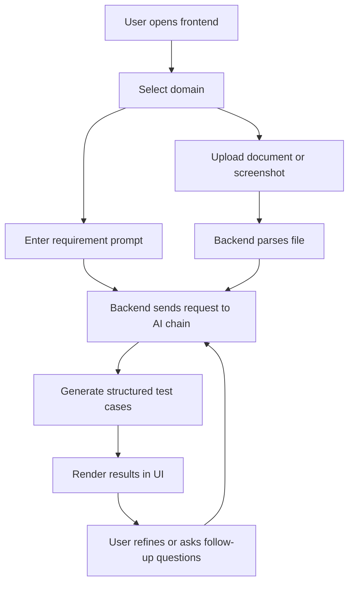

# Test Case Generator RAG

A full-stack application that helps QA teams generate structured test cases from requirements, uploaded documents, or screenshots. The project combines a React + TypeScript frontend with an Express + TypeScript backend powered by LangChain-based prompts and retrieval-augmented generation (RAG) workflows.

## What this project does

This app lets users:
- choose a domain such as banking, insurance, or hospital
- upload PDF, DOCX, Excel, or image files
- describe requirements in natural language
- generate structured test cases in JSON format
- continue refining the same conversation with follow-up prompts

## Tech stack

- Frontend: React, TypeScript, Vite, React Router
- Backend: Node.js, Express, TypeScript
- AI orchestration: LangChain
- Document parsing: PDF, DOCX, Excel, image processing
- Storage: MongoDB with vector support
- API testing: Postman collection included

## Project structure

| Path | Purpose |
| --- | --- |
| [backend](backend) | Backend server, API routes, AI chains, database configuration |
| [backend/src/app.ts](backend/src/app.ts) | Express app creation and global middleware |
| [backend/src/server.ts](backend/src/server.ts) | Backend entry point that starts the server |
| [backend/src/routes/chatRoute.ts](backend/src/routes/chatRoute.ts) | Chat endpoint for conversational test case generation |
| [backend/src/routes/testCaseRoute.ts](backend/src/routes/testCaseRoute.ts) | One-shot endpoint for generating test cases from text or image |
| [backend/src/routes/uploadRoute.ts](backend/src/routes/uploadRoute.ts) | File upload endpoint and parsing logic |
| [backend/src/chains/testCaseChain.ts](backend/src/chains/testCaseChain.ts) | Main chain logic for generating test cases |
| [backend/src/documents](backend/src/documents) | File parsing and image handling modules |
| [backend/src/factories/promptFactory.ts](backend/src/factories/promptFactory.ts) | Domain-specific prompts for banking, insurance, and hospital |
| [backend/src/config/env.ts](backend/src/config/env.ts) | Environment variable configuration |
| [backend/src/config/db.ts](backend/src/config/db.ts) | MongoDB connection setup |
| [frontend](frontend) | Vite React frontend |
| [frontend/src/App.tsx](frontend/src/App.tsx) | Main app shell and theme toggle |
| [frontend/src/components/ChatWindow.tsx](frontend/src/components/ChatWindow.tsx) | Main chat interface and prompt handling |
| [frontend/src/components/DomainSelector.tsx](frontend/src/components/DomainSelector.tsx) | Domain selector UI |
| [frontend/src/components/FileUpload.tsx](frontend/src/components/FileUpload.tsx) | Upload UI and progress handling |
| [frontend/src/components/TestCaseResultViewer.tsx](frontend/src/components/TestCaseResultViewer.tsx) | Display of generated test cases |
| [frontend/src/services/api.ts](frontend/src/services/api.ts) | Frontend API client for backend endpoints |
| [collection/testcase-generator-api.postman_collection.json](collection/testcase-generator-api.postman_collection.json) | Postman collection for all backend APIs |
| [INSTALL.md](INSTALL.md) | Quick installation guide |

## Prerequisites

Before you start, make sure you have:
- Node.js installed
- npm installed
- MongoDB running or reachable
- One of the supported LLM provider API keys configured:
  - GROQ_API_KEY
  - OPENAI_API_KEY
  - ANTHROPIC_API_KEY
  - MISTRAL_API_KEY

## Environment variables

Create a file named [.env](backend/.env) inside the backend folder and add the required values.

Example:

```env
PORT=5000
MONGODB_URI=mongodb://localhost:27017
MONGODB_DB_NAME=testcase_rag
ACTIVE_PROVIDER=groq
GROQ_API_KEY=your_key_here
MISTRAL_API_KEY=your_key_here
MODERATION_LAYER_ENABLED=true
MODERATION_LAYER_URL=http://localhost:3000
MODERATION_LAYER_API_KEY=your_moderation_api_key
```

You may also configure:
- CHUNK_SIZE
- CHUNK_OVERLAP
- RAG_TOP_K
- MAX_UPLOAD_SIZE_PDF
- MAX_UPLOAD_SIZE_DOCX
- MAX_UPLOAD_SIZE_EXCEL
- MAX_UPLOAD_SIZE_IMAGE
- ALLOWED_IMAGE_TYPES
- MODERATION_LAYER_ENABLED
- MODERATION_LAYER_URL
- MODERATION_LAYER_API_KEY

For the frontend, create a [.env](frontend/.env) file if needed:

```env
VITE_API_BASE_URL=http://localhost:5000
```

## Installation and setup

### 1. Backend

```bash
cd backend
npm install
npm run dev
```

The backend will start on the port defined in your environment (default: 5000).

### 2. Frontend

Open a new terminal:

```bash
cd frontend
npm install
npm run dev
```

Vite will print a local URL such as:

```text
http://localhost:5173
```

Open that URL in your browser.

## How to use the app

### 1. Select a domain
Choose one of the available domains:
- Banking
- Insurance
- Hospital

### 2. Upload a file (optional)
You can upload:
- PDF
- DOCX
- Excel
- PNG or GIF image

The app will extract text from documents or send screenshots to the AI pipeline.

### 3. Enter a requirement
Type a prompt such as:
- "Generate test cases for transfer OTP validation"
- "Validate loan approval rules for applicants under 25"
- "Create edge cases for claim rejection workflow"

### 4. Review generated test cases
The assistant returns structured test cases with:
- title
- steps
- expected result

### 5. Continue refining
Send follow-up prompts to refine the previous response, for example:
- add more negative cases
- remove duplicate scenarios
- focus on security checks

## API endpoints

The backend exposes the following endpoints:

| Method | Endpoint | Purpose |
| --- | --- | --- |
| GET | /api/health | Checks backend health and database connection |
| POST | /api/upload | Uploads a file and returns extracted text or image payload |
| POST | /api/generate-testcases | Generates test cases from text or image in one shot |
| POST | /api/chat | Supports conversational test case generation with session memory |

## Postman usage

Import the collection from [collection/testcase-generator-api.postman_collection.json](collection/testcase-generator-api.postman_collection.json).

Set the base URL variable to:

```text
http://localhost:5000
```

## Workflow diagram



## Use case diagram

```mermaid
usecase diagram
    actor QA as QAEngineer
    rectangle "Test Case Generator" {
        usecase "Choose domain" as UC1
        usecase "Upload document or screenshot" as UC2
        usecase "Describe requirements" as UC3
        usecase "Generate test cases" as UC4
        usecase "Refine generated results" as UC5
    }
    QA --> UC1
    QA --> UC2
    QA --> UC3
    QA --> UC4
    QA --> UC5
```

## Development commands

### Backend

```bash
cd backend
npm install
npm run dev
npm run build
npm start
```

### Frontend

```bash
cd frontend
npm install
npm run dev
npm run build
npm run preview
```

## Notes

- The app uses a RAG-style workflow, so the quality of results depends on the quality of the uploaded content and the configured LLM provider.
- If the backend fails to start, check your MongoDB connection and API key configuration first.
- For production usage, consider securing the API and managing secrets through environment variables or secret managers.

## Recommended next steps

- add authentication for multi-user workflows
- add export options for results such as CSV or Word
- add saved history and conversation persistence
- improve document chunking and retrieval quality
